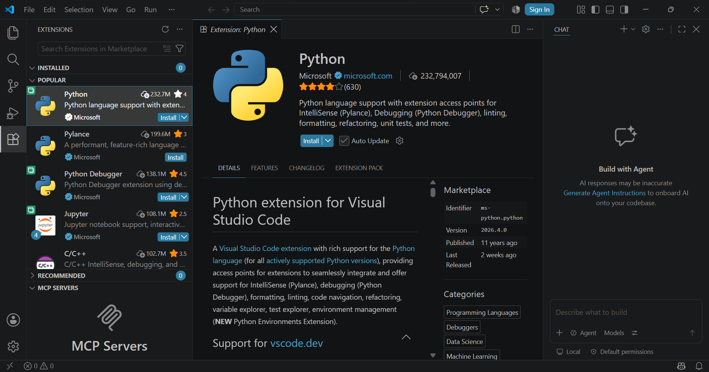
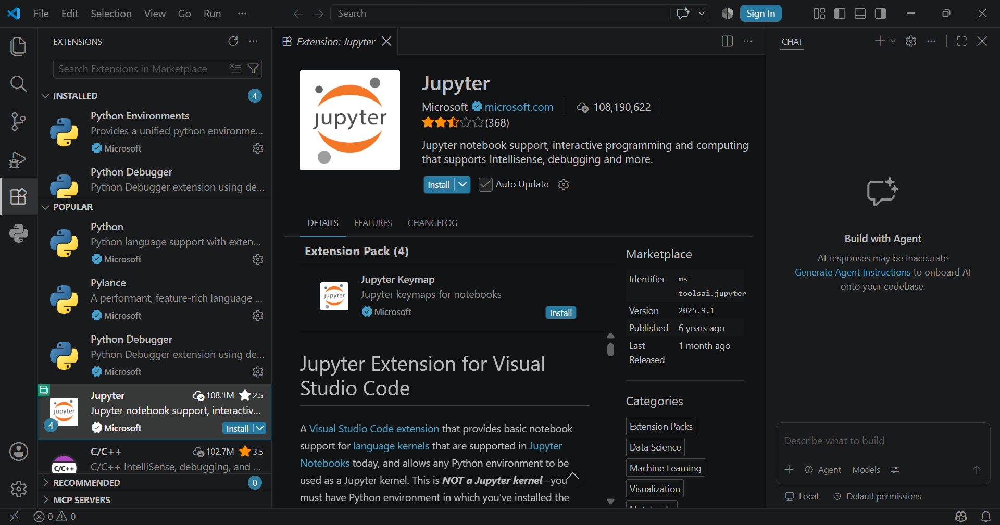
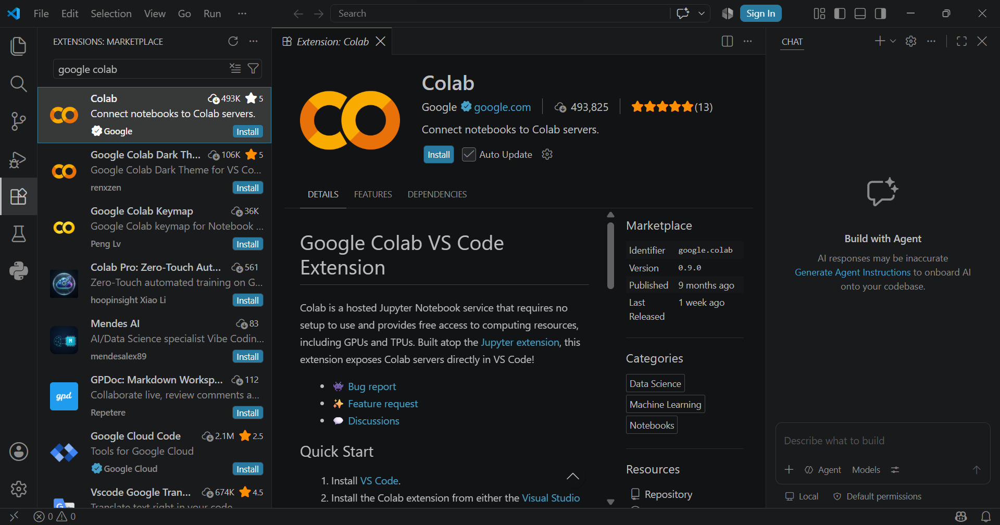

# 01 · Entorno y reproducibilidad

En este tema se introduce el problema de las dependencias de software,
el uso de entornos independientes y las herramientas que utilizaremos
para construir un entorno reproducible para el taller.

---
# 1.1 Problema de dependencias y concepto de entorno
Antes de comenzar a trabajar con imágenes y modelos, necesitamos preparar un entorno de trabajo que podamos identificar, administrar y reproducir.

En esta sección veremos por qué las dependencias y sus versiones pueden afectar la ejecución de un proyecto, prepararemos las herramientas necesarias y practicaremos con **Conda** la creación y administración de entornos de Python y de sus paquetes.

### 📽️ Presentación

[**Ver presentación del tema →**](../../recursos/presentaciones/01-01-entorno-y-reproducibilidad.pdf)

---

# 🛠️ Preparación del entorno de trabajo

Antes de comenzar con las actividades del taller, prepararemos las
herramientas que utilizaremos para desarrollar y ejecutar nuestros proyectos.

En esta guía encontrarás las instrucciones necesarias para instalar y
configurar el entorno de trabajo.

## 🐍 Instalación de Miniconda

Durante el taller utilizaremos **Miniconda** para disponer de Conda
sin instalar de forma predeterminada una colección extensa de paquetes.

Sigue las instrucciones del instalador correspondientes a tu sistema operativo.

### - Windows
[Descarga el instalador gráfico de Miniconda desde el sitio oficial →](https://www.anaconda.com/download/success?reg=skipped-miniconda)

[Pasos para instalación en Windows →](https://www.anaconda.com/docs/getting-started/miniconda/install/windows-gui-install)

Una vez instalado, se debe abrir la aplicación de Miniconda/Anaconda Prompt y ejecutar los siguientes comandos (todas las ventanas de línea de comandos y de VS Code deben estar cerradas).

```batch
conda config --set auto_activate_base false
conda init powershell
```

Posteriormente, se debe cerrar esa ventana de Miniconda/Anaconda Prompt.

### - Linux

[Pasos para instalación en Linux →](https://www.anaconda.com/docs/getting-started/miniconda/install/linux-install)


### - macOS

[Pasos para instalación en macOS →](https://www.anaconda.com/docs/getting-started/miniconda/install/mac-cli-install)


### Nota para Linux y macOS

Es recomendable que Conda no active el entorno base automáticamente cada vez que se abra la terminal. Para configurar esto, debes ejecutar esta instrucción en terminal:

```batch
conda config --set auto_activate_base false
```

---

## ⚙️ Instalación de Visual Studio Code (VS Code)

Durante el taller utilizaremos **Visual Studio Code (VS Code)** como entorno de desarrollo para trabajar con el código, los archivos y los proyectos. Antes de continuar, descarga e instala VS Code en tu computadora.

[Descarga VS Code desde el sitio oficial →](https://code.visualstudio.com/download)


### 🐍 Instalar la extensión de Python

Para trabajar con Python desde VS Code utilizaremos la extensión **Python**, desarrollada por **Microsoft**.

Una vez instalado VS Code:

1. Abre **Visual Studio Code**.
2. Selecciona la sección **Extensions** en la barra lateral.
3. Busca `Python`.
4. Localiza la extensión **Python** publicada por **Microsoft**.
5. Selecciona **Install**.

> [!IMPORTANT]
> Verifica que la extensión seleccionada sea la publicada por **Microsoft**.




### 🚀 Instalar la extensión de Jupyter

La extensión **Jupyter** da soporte para el uso de Jupyter notebooks en VS Code.

Para instalarlo:

1. Dentro de VS Code, selecciona la sección **Extensions** en la barra lateral.
2. Busca `Jupyter`.
3. Localiza la extensión **Jupyter** publicada por **Microsoft**.
4. Selecciona **Install**.

> [!IMPORTANT]
> Verifica que la extensión seleccionada sea la publicada por **Microsoft**.



### ✨ Instalar la extensión de Colab

Google ha desarrollado una extensión para VS Code llamada **Colab**, la cual permite conexiones hacia servidores de Google Colab desde VS Code.

Para instalarlo:

1. Dentro de VS Code, selecciona la sección **Extensions** en la barra lateral.
2. Busca `Colab`.
3. Localiza la extensión **Colab** publicada por **Google**.
4. Selecciona **Install**.

> [!IMPORTANT]
> Verifica que la extensión seleccionada sea la publicada por **Google**.



---

## 🔎 Verificar la instalación de Git

Antes de instalar **Git**, verifica si ya se encuentra disponible en tu computadora.

Abre una terminal y ejecuta:

```bash
git --version
```

Si Git está instalado correctamente, se mostrará la versión disponible en tu sistema.

Si el comando no es reconocido o Git no está disponible, sigue las instrucciones correspondientes a tu sistema operativo:

| Sistema operativo | Si Git no está disponible |
|---|---|
| 🪟 **Windows** | [Instalar **Git for Windows** →](../../practicas/01-entorno-y-reproducibilidad/00-instalar_git_windows.md) |
| 🐧 **Ubuntu/Debian** | Ejecutar `sudo apt install git` |
| 🍎 **macOS** | Ejecutar `xcode-select --install` |

> [!NOTE]
> El comando `git --version` es el mismo en **Windows, Linux y macOS**.
> Lo que cambia es el procedimiento de instalación en caso de que Git no esté disponible.

---

## 🧪 Prácticas

1. [Comandos esenciales de Conda →](../../practicas/01-entorno-y-reproducibilidad/entorno-y-reproducibilidad/01-comandos_conda.md)
2. [Trabajando con environment.yml →](../../practicas/01-entorno-y-reproducibilidad/entorno-y-reproducibilidad/02-trabajando_environment_yml.md)

---

## ➡️ Siguiente tema

[Directorio de trabajo y tipos de rutas →](./01-02-directorio-trabajo-y-tipos-rutas.md)

---

[← Volver al índice de módulos](../modulos.md)

[← Volver a la portada del taller](../../README.md)