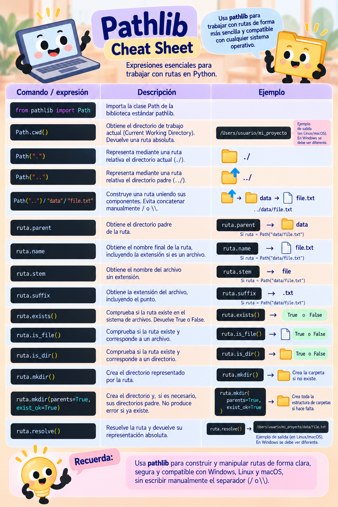

# 📁 Uso de rutas con `pathlib`

Cuando un proyecto contiene datos, notebooks y resultados en diferentes carpetas, el código necesita indicar **dónde se encuentra cada archivo**.

En esta práctica, a partir de un archivo `environment.yml`, crearás el entorno de trabajo, lo utilizarás como kernel de un Jupyter Notebook en VS Code, construirás una pequeña estructura de proyecto y utilizarás `pathlib` para navegar entre sus directorios, localizar un archivo de entrada, leer su contenido y guardar un nuevo archivo de resultados.

Como referencia, puedes consultar la siguiente *cheat sheet* durante la práctica:



---

## 🎯 Objetivo

Practicar el uso de **rutas relativas y absolutas** con `pathlib` para navegar por la estructura de un proyecto, acceder a archivos y guardar resultados.

---

## 💻 Instrucciones

### 1 · Crea la estructura del proyecto

Abre **Visual Studio Code** y crea una carpeta para esta práctica.

Dentro de ella, crea las siguientes carpetas:

```text
proyecto/
├── data/
├── notebooks/
└── results/
```

Esta carpeta será la **raíz del proyecto**.

---

### 2 · Crea el archivo `environment.yml`

En la **raíz del proyecto**, crea un archivo llamado:

```text
environment.yml
```

La estructura quedará temporalmente así:

```text
proyecto/
├── data/
├── notebooks/
├── results/
└── environment.yml
```

Utiliza el archivo `environment.yml` para describir el entorno de Python necesario para trabajar con el notebook.

Agrega el siguiente contenido:

```yaml
name: entorno-rutas

channels:
  - conda-forge

dependencies:
  - python=3.11
  - ipykernel
```

En este entorno:

- `python=3.11` especifica la versión de Python que utilizaremos;
- `ipykernel` permite utilizar el entorno como **kernel de Jupyter**.

---

### 3 · Crea el entorno

Abre una terminal en VS Code y comprueba que te encuentras en la **raíz del proyecto**, donde está ubicado `environment.yml`.

Crea el entorno utilizando:

```bash
conda env create -f environment.yml
```

Cuando termine el proceso, activa el entorno:

```bash
conda activate entorno-rutas
```

Verifica que estás utilizando la versión de Python esperada:

```bash
python --version
```

También puedes comprobar que `ipykernel` está disponible:

```bash
python -c "import ipykernel; print(ipykernel.__version__)"
```

> [!IMPORTANT]
> El entorno se crea a partir de la descripción contenida en
> `environment.yml`. El archivo forma parte del **proyecto**, mientras que el entorno de Conda se crea y administra de manera independiente.

---

### 4 · Crea el archivo de entrada

Dentro de `data`, crea un archivo llamado:

```text
input.txt
```

Escribe en él:

```text
¡Hola mundo!
```

La estructura deberá quedar así:

```text
proyecto/
├── data/
│   └── input.txt
├── notebooks/
├── results/
└── environment.yml
```

---

### 5 · Crea el notebook

Dentro de la carpeta `notebooks`, crea un Jupyter Notebook llamado:

```text
uso_rutas.ipynb
```

Ahora tendrás:

```text
proyecto/
├── data/
│   └── input.txt
├── notebooks/
│   └── uso_rutas.ipynb
├── results/
└── environment.yml
```

Abre el notebook y utiliza **Select Kernel** para seleccionar el entorno:

```text
entorno-rutas
```

Antes de continuar, comprueba que el notebook está utilizando el kernel correspondiente al entorno que acabas de crear.

---

### 6 · Importa `Path`

En la primera celda de código importa la clase `Path`:

```python
from pathlib import Path
```

---

### 7 · Obtén el directorio de trabajo actual

Utiliza `Path.cwd()` para consultar el directorio desde el cual se está ejecutando el notebook:

```python
directorio_actual = Path.cwd()

print("Directorio de trabajo actual:")
print(directorio_actual)
```

Observa la ruta obtenida.

Si el notebook se está ejecutando desde la carpeta `notebooks`, la ruta deberá terminar en:

```text
.../proyecto/notebooks
```

> [!NOTE]
> `Path.cwd()` devuelve el **directorio de trabajo actual** (*Current Working Directory*). Este directorio sirve como punto de referencia para interpretar las rutas relativas.

---

### 8 · Obtén la ruta a la raíz del proyecto

El directorio de trabajo se encuentra dentro de `notebooks`. Por lo tanto, para regresar a la raíz del proyecto necesitamos subir **un nivel**.

Construye una ruta relativa utilizando `..`:

```python
raiz_proyecto = Path("..")

print("Ruta a la raíz del proyecto:")
print(raiz_proyecto)
```

En una ruta relativa:

```text
..
```

representa el **directorio padre**.

---

### 9 · Construye la ruta hacia `input.txt`

Partiendo de la raíz del proyecto, utiliza el operador `/` de `pathlib` para construir la ruta hacia el archivo `input.txt`:

```python
ruta_input = raiz_proyecto / "data" / "input.txt"

print("Ruta del archivo de entrada:")
print(ruta_input)
```

La ruta construida será equivalente a:

```text
../data/input.txt
```

> [!TIP]
> Con `pathlib` no es necesario concatenar manualmente `/` o `\`.
> El operador `/` permite unir los componentes de una ruta.

---

### 10 · Lee el contenido de `input.txt`

Utiliza la ruta que acabas de construir para abrir el archivo:

```python
with open(ruta_input, "r", encoding="utf-8") as archivo:
    contenido = archivo.read()

print(contenido)
```

La salida deberá mostrar:

```text
¡Hola mundo!
```

---

### 11 · Construye la ruta hacia `results`

Ahora utiliza nuevamente la raíz del proyecto para obtener la ruta de la carpeta `results`:

```python
ruta_results = raiz_proyecto / "results"

print("Ruta de resultados:")
print(ruta_results)
```

Después construye la ruta del archivo de salida:

```python
ruta_output = ruta_results / "output.txt"

print("Archivo de salida:")
print(ruta_output)
```

---

### 12 · Obtén el nombre del archivo de entrada

Utiliza `.name` para obtener únicamente el nombre del archivo representado por `ruta_input`:

```python
nombre_input = ruta_input.name

print(nombre_input)
```

El resultado será:

```text
input.txt
```

---

### 13 · Guarda el contenido en `output.txt`

Construye un mensaje utilizando `.name` y el contenido que leíste anteriormente:

```python
mensaje = f"Contenido de {ruta_input.name}: {contenido}"

print(mensaje)
```

Ahora guarda el mensaje en `output.txt`:

```python
with open(ruta_output, "w", encoding="utf-8") as archivo:
    archivo.write(mensaje)
```

Después de ejecutar la celda aparecerá:

```text
proyecto/
├── data/
│   └── input.txt
├── notebooks/
│   └── uso_rutas.ipynb
└── results/
    └── output.txt
```

---

### 14 · Obtén la ruta absoluta de `input.txt`

Hasta ahora hemos trabajado con una ruta relativa:

```text
../data/input.txt
```

Utiliza `.resolve()` para obtener su **ruta absoluta**:

```python
ruta_absoluta_input = ruta_input.resolve()

print("Ruta absoluta:")
print(ruta_absoluta_input)
```

Observa cómo ahora la ruta comienza desde la ubicación correspondiente al sistema de archivos de tu computadora.

---

### 15 · Agrega la ruta absoluta al archivo de resultados

Queremos que `output.txt` contenga ahora dos líneas:

```text
Contenido de input.txt: ¡Hola mundo!
input.txt se encuentra en: RUTA_ABSOLUTA
```

Construye la segunda línea utilizando `.name` y `.resolve()`:

```python
ubicacion = (
    f"{ruta_input.name} se encuentra en: {ruta_input.resolve()}"
)

print(ubicacion)
```

Finalmente, vuelve a escribir `output.txt` incluyendo ambos mensajes:

```python
with open(ruta_output, "w", encoding="utf-8") as archivo:
    archivo.write(
        f"Contenido de {ruta_input.name}: {contenido}\n"
        f"{ruta_input.name} se encuentra en: {ruta_input.resolve()}"
    )
```

Abre `results/output.txt` desde el explorador de archivos de VS Code y comprueba su contenido.

---

## 🤔 Observa e interpreta

Al finalizar, compara las siguientes expresiones:

```python
Path.cwd()
```

```python
Path("..")
```

```python
Path("..") / "data" / "input.txt"
```

```python
(Path("..") / "data" / "input.txt").resolve()
```

Reflexiona:

- ¿Cuál de estas rutas es relativa?
- ¿Cuál es absoluta?
- ¿Desde qué directorio se interpreta `..`?
- ¿Qué información devuelve `.name`?
- ¿Qué cambia cuando utilizamos `.resolve()`?
- ¿Por qué puede ser conveniente construir las rutas a partir de la raíz del proyecto en lugar de escribir rutas absolutas manualmente?

---

## ✅ Punto de control

Al finalizar esta práctica habrás practicado:

- identificar el directorio de trabajo con `Path.cwd()`;
- utilizar `..` para representar el directorio padre;
- construir rutas mediante el operador `/`;
- navegar entre las carpetas de un proyecto;
- leer y escribir archivos utilizando objetos `Path`;
- obtener el nombre de un archivo mediante `.name`;
- convertir una ruta relativa en absoluta mediante `.resolve()`;
- utilizar una misma estructura de proyecto sin escribir rutas absolutas específicas de una computadora.

---

[← Volver a Directorio de trabajo y tipos de rutas](../../../modulos/01-entorno-y-reproducibilidad/01-02-directorio-trabajo-y-tipos-rutas.md)